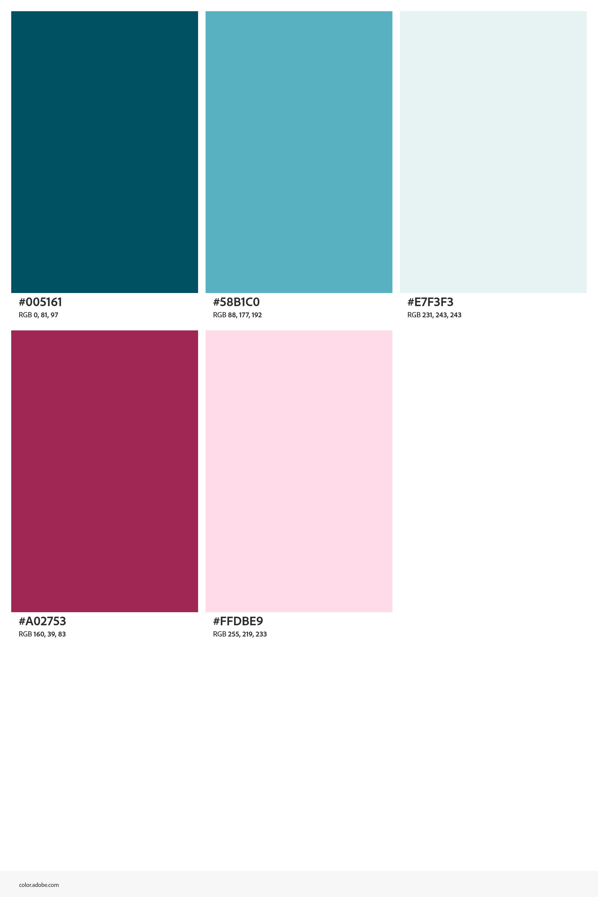

# README
Nayelli Tejada

# Description
The purpose of this project is to learn the fundamentals of html and css. Many skills were learned such as changing the font, size, and weight of text as well as adding images and changing their sizes. I also learned display layouts to make websites look better at different sizes. Later in the semester this project taught me to add videos and a forum for contacting. Overall, this project was a perfect way to learn and understand many important skills to become a successful web designer.

# Color Scheme

#005161 rgb(0 81 97)
#58B1C0 rgb(88 177 192)
#E7F3F3 rgb(231 243 243)
#A02753 rgb(160 39 83)
#FFDBE9 rgb(255 219 233)

# Citations
https://www.youtube.com/watch?v=VEHk5B78ACM&t=526s
GITHUB ICON: https://icons.getbootstrap.com/icons/github/
BEACH: https://unsplash.com/photos/coconut-trees-and-body-of-water-painting-eaI3VpRnMbw
https://css-tricks.com/masking-vs-clipping-use/
https://css-tricks.com/clipping-masking-css/
https://www.geeksforgeeks.org/html/how-to-use-css-and-svg-clipping-and-masking-techniques/
# License
© 2026 Nayelli Tejada. All Rights Reserved.
